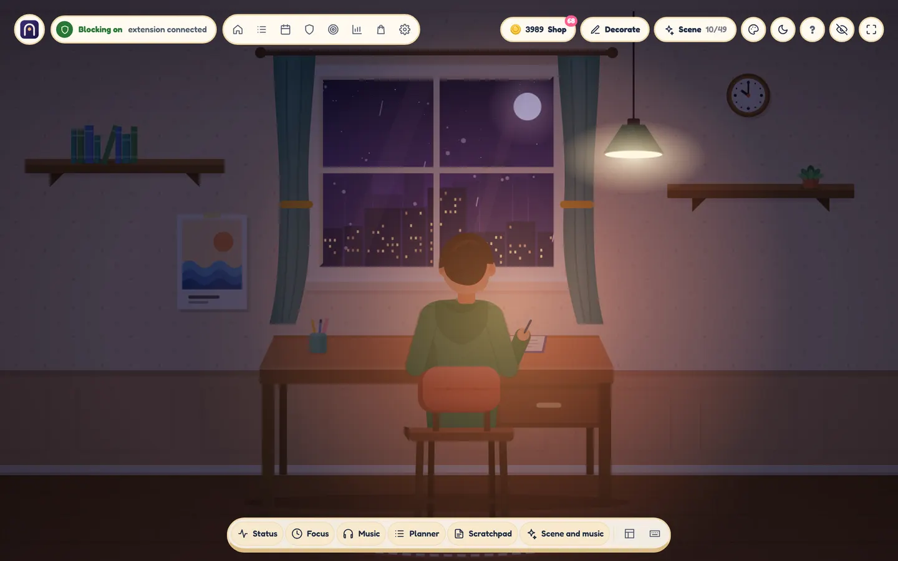
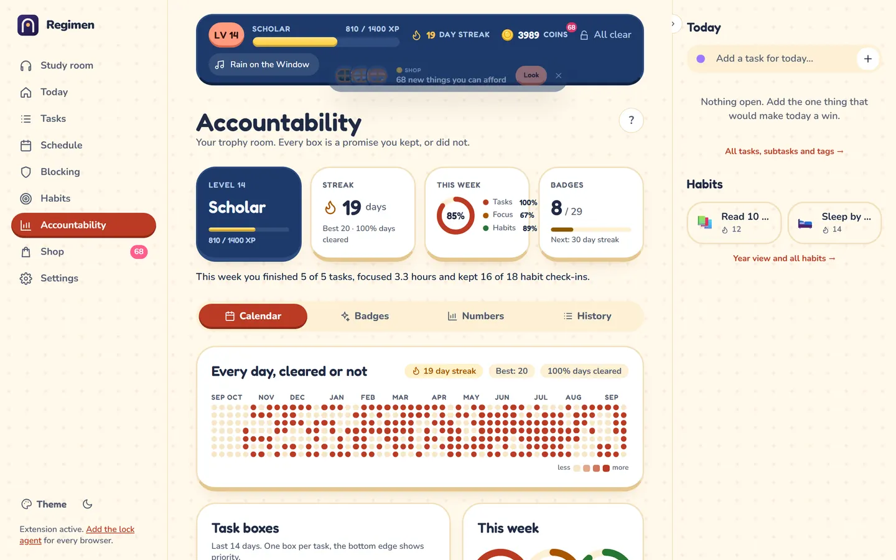

<p align="center">
  
</p>

<h1 align="center">Regimen</h1>

<p align="center"><b>Your tasks first. Then the internet.</b><br />
A site blocker that only lets go when your work is done, with a cozy study room to do the work in.</p>

<p align="center">
  <a href="https://github.com/AryanMotiani/regimen/actions/workflows/ci.yml"></a>
  <a href="https://github.com/AryanMotiani/regimen/actions/workflows/pages.yml"></a>
  <a href="LICENSE"></a>
  <a href="CONTRIBUTING.md"></a>
</p>

<p align="center">
  <a href="https://aryanmotiani.github.io/regimen/"><b>Open Regimen</b></a> ·
  <a href="https://aryanmotiani.github.io/regimen/#/install">Install</a> ·
  <a href="docs/USER-GUIDE.md">User guide</a> ·
  <a href="docs/ARCHITECTURE.md">How it works</a>
</p>

<p align="center">
  
</p>

Regimen is free and open source. It works in Chrome, Edge, Brave, Opera, Vivaldi, Arc and Firefox, and with the optional lock agent it blocks in every browser and app on your computer, Safari included. No account, no server, no tracking.

## What it does

- **Task-gated blocking.** Pick sites and a time window, attach tasks. The sites stay blocked until every task is done. If the window ends with work left, the block keeps going until you finish. An empty window stays blocked too, so there is no loophole.
- **Hard blocks.** Blocked for the whole window, full stop. For the days you really mean it, turn off the escape hatch for a rule.
- **Focus sessions.** Pomodoro-style rounds that start right away and block your picked sites through the breaks as well.
- **Failsafe.** The emergency exit, made slow on purpose: an "are you sure?", your PIN, a wait you choose (30 seconds to 5 minutes) and a typed reason with pasting turned off. It unlocks only the current window and is logged.
- **Study room.** Your home screen: a little room with a student at a desk, a window onto a scene, and windows you drag, resize and dock (focus timer, planner, music, scratchpad, scene). A generative lofi radio and optional rain or fireplace sounds play right in the browser, so the music keeps going when YouTube is blocked.
- **Decor, coins and shop.** Studying, finishing tasks and keeping habits earn XP, levels and coins. Spend coins on decor, avatar looks, room styles, scenes and music. Daily caps and minimum task ages keep it honest, so the coins mean you studied.
- **Habits.** A minimal tracker on purpose: pick the days, tick them off, keep the streak.
- **Accountability.** A clear picture of how your windows, blocks, tasks and focus time went, the good stuff first, with charts for the last two weeks and the reasons you typed when you gave in.
- **Tasks and schedule.** Deadlines, subtasks, tags, repeats, a stopwatch per task, a board and a week view. Pushing a task to the next window is limited by its priority.
- **Game and Calm themes.** Eight full themes in two styles (Game: Sunny Quest, Storybook, Arcade, Night Owl. Calm: Paper, Nordic, Midnight Library, Studio), each in light and dark.

<p align="center">
  
</p>

## Get started

1. **Open the website:** [aryanmotiani.github.io/regimen](https://aryanmotiani.github.io/regimen/). You can try the study room, tasks and habits right away. Your data stays in your browser.
2. **Add the browser extension** to make blocking work. The [Install page](https://aryanmotiani.github.io/regimen/#/install) detects your browser and shows the quickest way. Store listings (Firefox Add-ons, Edge Add-ons, Chrome Web Store) are on the way. Until then the Install page walks you through installing the extension by hand in a few clicks, from the [latest release](https://github.com/AryanMotiani/regimen/releases/latest).
3. **Optional: the lock agent.** One download (`Regimen-Setup.exe` for Windows, `Regimen.pkg` for macOS, `.deb` or `.rpm` for Linux, also on the Install page). It blocks in every browser and app, switches off Secure DNS and private windows, and keeps a no-escape block going even if the extension is removed. The downloads are not code-signed yet, so Windows and macOS warn once: see [Installing the lock agent](docs/INSTALL-AGENT.md).

Already set up on the website before installing the extension? Nothing to redo: your PIN, rules, tasks and habits move into the extension by themselves.

More: the [user guide](docs/USER-GUIDE.md) and [sites not blocked?](docs/TROUBLESHOOTING-blocking.md)

## Privacy

Regimen is local first. There is no account and no Regimen server: your tasks, rules, habits and room live in your browser's storage or the extension's storage, and the lock agent keeps its files on your computer. Regimen never receives your data, and there are no cookies, analytics or ads. Backups are a JSON file you export and import yourself (Settings, Backup). Details in the [privacy policy](https://aryanmotiani.github.io/regimen/privacy.html).

## FAQ

**Can't I just turn it off?** You can, slowly. That is the point. The Failsafe takes your PIN, a wait and a typed reason, and a rule without Failsafe can't be edited or deleted while it runs. With the lock agent, removing the extension or switching browsers doesn't help either. Anyone with admin rights can undo software on their own computer in the end, so Regimen aims to make giving in deliberate and visible, not impossible.

**Does it work on my phone?** Not yet. The website works on a phone for tasks, habits and the study room, but blocking needs a desktop browser extension. See the [roadmap](docs/ROADMAP.md).

**I used FocusGateway. Is my data still there?** Yes. FocusGateway was this project's old name. The website, the extension and the lock agent all move your data from the old names on first start, the agent pairing included.

## For developers

Regimen is an npm workspaces monorepo: a Vue 3 web app, a Manifest V3 extension, a shared rules engine in plain JavaScript and an optional lock agent in Go. Start with **[ARCHITECTURE.md](docs/ARCHITECTURE.md)** for the big picture and the [developer guide](docs/DEVELOPER-GUIDE.md) for recipes.

Needs Node.js 20.19 or newer (the lock agent also needs Go 1.24 or newer).

```bash
npm ci
npm run dev          # web app at http://localhost:5173
npm test             # unit tests (engine, backend, migrations)
npm run check        # lint, format check, unit tests and build, like CI
npm run agent:test   # go vet and go test for the lock agent
```

End-to-end tests load the real extension into Chromium and check that sites are really blocked:

```bash
npm run build && npm run agent:build
npx playwright install chromium
npm run test:e2e
```

Load your build in Chrome at `chrome://extensions` (Developer mode, **Load unpacked**, `extension/dist/chromium`), or in Firefox at `about:debugging` (**Load Temporary Add-on**, `extension/dist/firefox/manifest.json`).

The website deploys to GitHub Pages after CI passes on `master` ([DEPLOYMENT.md](docs/DEPLOYMENT.md)). Releases are built from version tags ([RELEASING.md](docs/RELEASING.md)).

## Contributing

Contributions are welcome, from adding a distracting site to a block list to new room decor or a whole feature. Read [CONTRIBUTING.md](CONTRIBUTING.md) and the [Code of Conduct](CODE_OF_CONDUCT.md). Found a way around a block, or a security problem? Please report it privately as described in [SECURITY.md](SECURITY.md). Ideas for what comes next are in the [roadmap](docs/ROADMAP.md).

## License

[MIT](LICENSE)
