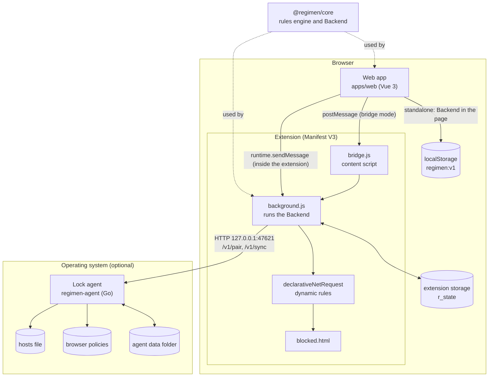
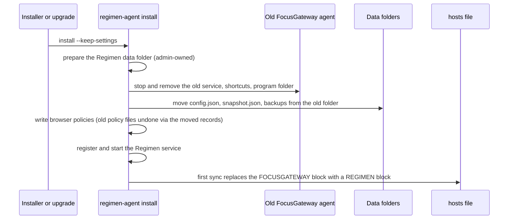
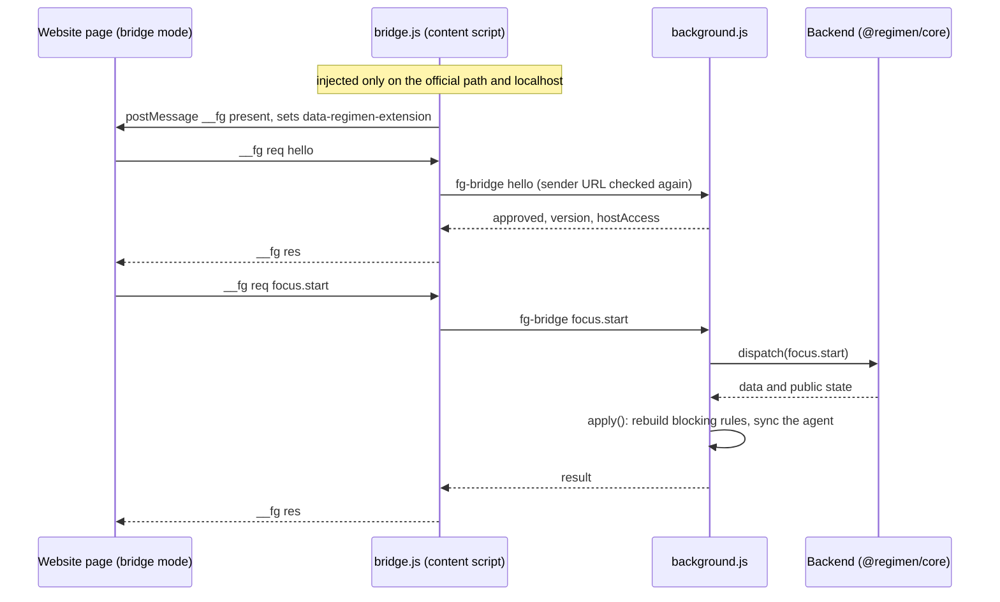
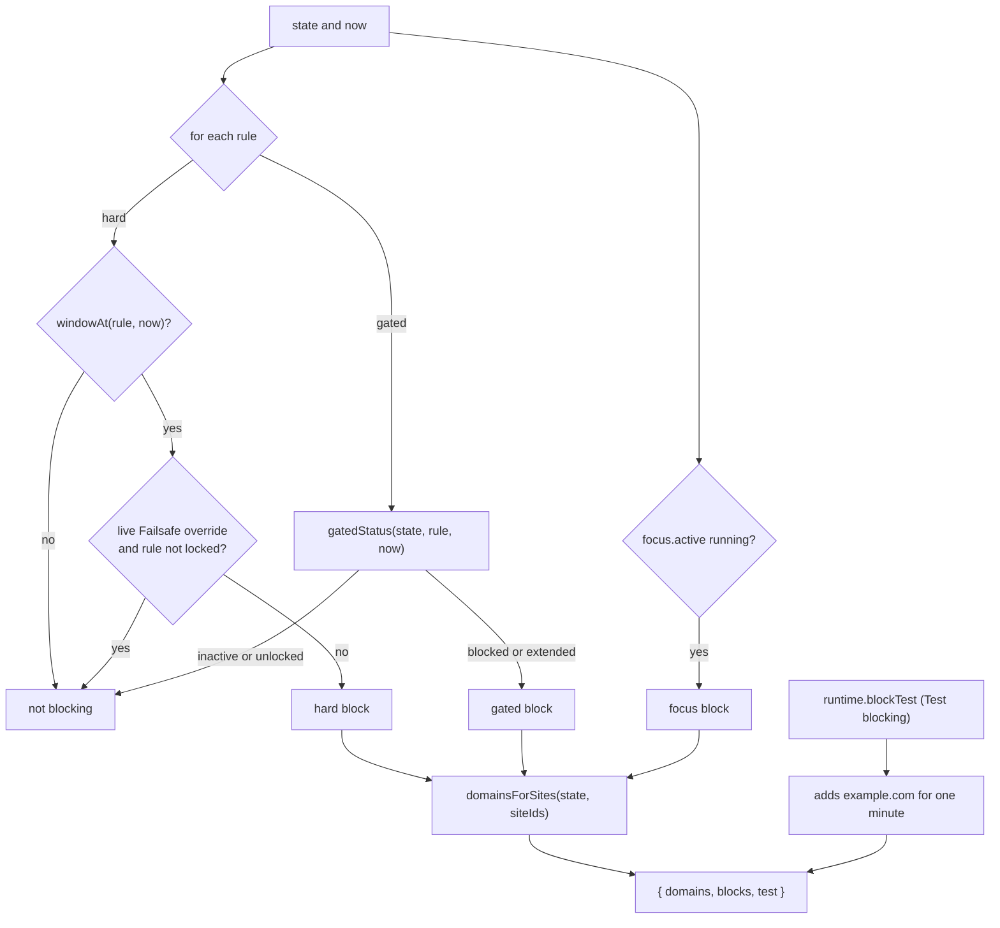
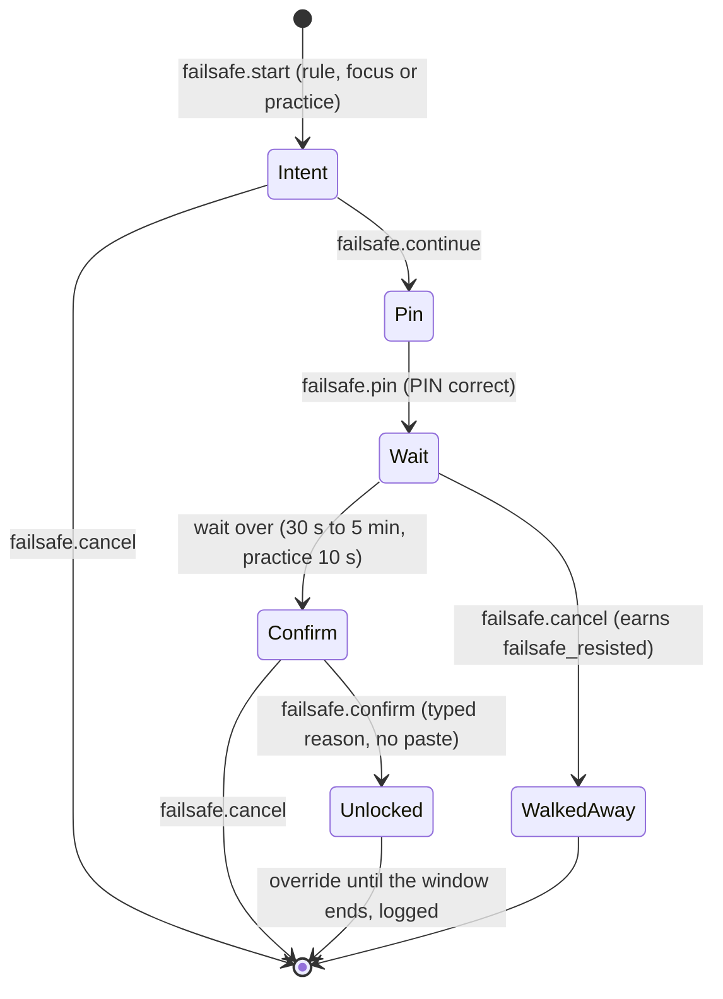
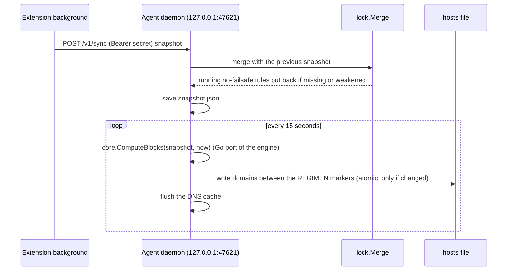
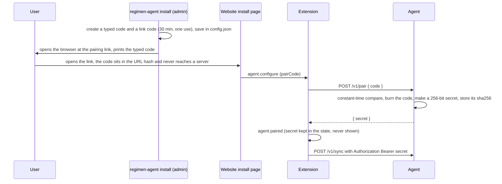
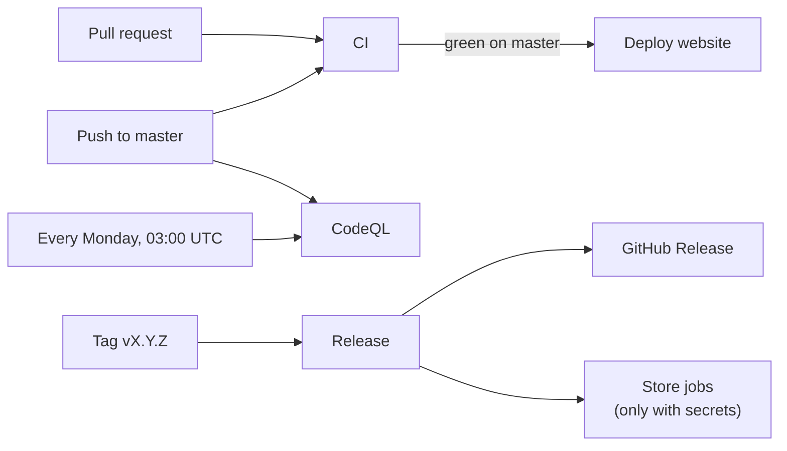

# Regimen architecture

This is the map of the whole codebase: what each part does, how the parts talk, where data lives, how a site actually gets blocked, and how code goes from a pull request to a release. Read it top to bottom once, then use [Where to change what](#where-to-change-what) as an index.

For recipes (add a theme, a room item, a track, a badge, a backend command) see the [developer guide](DEVELOPER-GUIDE.md). For releases see [RELEASING.md](RELEASING.md), for hosting see [DEPLOYMENT.md](DEPLOYMENT.md).

**Contents**

1. [The big picture](#the-big-picture)
2. [Monorepo layout](#monorepo-layout)
3. [Tech stack and why](#tech-stack-and-why)
4. [Data model](#data-model)
5. [Where data is stored](#where-data-is-stored)
6. [Migrations](#migrations)
7. [The Backend and how every UI talks to it](#the-backend-and-how-every-ui-talks-to-it)
8. [How blocking works, end to end](#how-blocking-works-end-to-end)
9. [The lock agent](#the-lock-agent)
10. [XP, coins, levels and anti-farming](#xp-coins-levels-and-anti-farming)
11. [The study room](#the-study-room)
12. [Themes](#themes)
13. [Tours, tips and synced UI flags](#tours-tips-and-synced-ui-flags)
14. [Time and the clock](#time-and-the-clock)
15. [Testing](#testing)
16. [CI/CD](#cicd)
17. [Release checklist](#release-checklist)
18. [Where to change what](#where-to-change-what)

## The big picture

Regimen has no server. Everything runs on the user's computer, in three places:

- the **web app** (Vue), which is what people see, served from GitHub Pages and also bundled inside the extension,
- the **browser extension** (Manifest V3), which owns the data and does the blocking in the browser,
- the optional **lock agent** (Go), a small system service that blocks for every browser and app through the hosts file and closes the usual escape routes with browser policies.

One shared JavaScript package, `@regimen/core`, holds every rule (the Backend). The extension runs it, the web app runs it when there is no extension, and the agent carries a Go port of the blocking part that is tested against it.



The product idea behind all of it: make giving in slow, deliberate and visible. Rules that protect the user (PIN checks, waits, typed confirmations, the empty-window rule) live in the Backend, never in the UI, so no UI can skip them.

## Monorepo layout

npm workspaces (`packages/*`, `apps/*`, `extension`) plus a Go module in `agent/`.

| Path | What it is |
|---|---|
| `packages/core` | `@regimen/core`. Pure JavaScript, no DOM. The Backend (`backend.js`), the blocking engine (`engine.js`, `schedule.js`, `sites.js`, `bundles.js`), state and migrations (`state.js`), tasks and habits, XP and coins (`progress.js`, `economy.js`, `milestones.js`), the catalogs for themes, room, unlocks and music (`appearance.js`, `room.js`, `unlocks.js`, `options.js`, `tracks.js`, `lofi.js`), seen-state (`ui.js`), time helpers, PBKDF2 hashing (`crypto.js`). Tests in `packages/core/test`. |
| `apps/web` | The Vue 3 web app: landing page, onboarding, the study room (home), Today, Tasks, Schedule, Blocking, Habits, Accountability, Shop, Settings, Install, Recover. `src/lib/api.js` connects it to a Backend, `src/lib/store.js` holds the reactive state. |
| `extension` | Manifest V3 extension for Chromium and Firefox. `src/background.js` (Backend, blocking, agent sync), `src/bridge.js` (lets the hosted website talk to the extension), `src/blocked.*` (the page a blocked site turns into), `src/popup.*`, `src/grant.*` (asks Firefox for website access), `src/app-url.js` (which copy of the app to open), `src/legacy.js` (storage migration). `build.mjs` builds `dist/chromium`, `dist/firefox`, `dist/e2e-chromium` and the zips, with the web app bundled into `app/`. |
| `agent` | The lock agent in Go, standard library only. `cmd/regimen-agent` is the entry point, `internal/*` the packages (see [The lock agent](#the-lock-agent)). `agent/test` has a vitest check that the agent's embedded copies of the bundles, TROUBLESHOOTING.md and LICENSE are current. |
| `packaging` | Installers for the agent: NSIS (`windows/regimen.nsi`), the macOS `.pkg` (`macos/`), `.deb` and `.rpm` (`linux/nfpm.yaml`), `install.sh`, and templates for winget, Homebrew and AUR. |
| `scripts` | Node scripts: `build-agent.mjs` (cross builds the agent with the version and website URL embedded), `gen-agent-golden.mjs` (golden test data for the Go engine), `sync-agent-bundles.mjs` (copies bundles and docs into the agent), `landing-media.mjs` and `store-screenshots.mjs` (screenshots and the demo video), `set-repo.mjs` (rewrites GitHub links for forks). |
| `tests/e2e` | Playwright tests with the real extension in Chromium, fake distracting sites and the real agent binary. |
| `docs` | User guide, developer guide, this file, deployment, releasing, roadmap, agent install guide, troubleshooting and the store listing material (`docs/store`). `docs/deploy` holds optional configs for other hosts. |
| `.github` | Workflows (CI, Pages deploy, release, CodeQL), Dependabot, issue and PR templates, CODEOWNERS. |
| `private/` | Not in git (`.gitignore`). Local notes, specs, AI outputs and screenshots that are not part of the public project. |

## Tech stack and why

| Part | Choice | Why |
|---|---|---|
| UI framework | Vue 3 with `<script setup>` | Small, fast, single file components, easy for new contributors. |
| Styling | Tailwind CSS 4 plus CSS custom properties per theme | Utility classes for layout, theme tokens (`--fg-*`) for colours, fonts and shapes, so a theme is data, not new components. |
| Build | Vite | Fast dev server, static output with relative paths (`base: './'`) that works on any host and inside the extension. |
| Routing | Vue Router with hash history | `#/today` works on a GitHub Pages sub-path, on any static host and at `chrome-extension://` without server rewrites. |
| Fonts | `@fontsource` packages | Bundled with the app, no requests to font CDNs (privacy, offline). |
| Rules engine | Plain ES modules (`@regimen/core`) | Runs unchanged in the extension's service worker, in the page and in Node tests. |
| Extension | Manifest V3, `declarativeNetRequest`, built with esbuild | The browser does the blocking (fast, no request inspection by our code). One codebase for Chromium and Firefox. |
| Storage | `chrome.storage.local`, `localStorage`, JSON files | No database server: zero cost, nothing to host, data never leaves the computer. Export and import JSON for backups. |
| Lock agent | Go, standard library only | One static binary of a few MB per platform, no runtime to install, easy cross compilation, runs as a system service. |
| Agent service | Task Scheduler, launchd, systemd | The OS restarts a crashed agent, so there is no custom watchdog. |
| Music | Web Audio API | Generated live in the browser: no audio files, no streaming, no licensing, and it plays while YouTube is blocked. |
| Unit tests | Vitest | Fast, ESM native, same syntax as Jest. |
| End-to-end tests | Playwright | Can load an unpacked extension into Chromium and map fake domains to a local server. |
| Agent tests | `go test` | Plus golden files generated from the JavaScript engine, so both engines agree. |
| CI/CD | GitHub Actions, GitHub Pages | Free for public repositories, everything in the repository. |

## Data model

The whole app state is one JSON object. `defaultState()` in `packages/core/src/state.js` lists every key:

```text
{
  schemaVersion: 1,
  createdAt,
  onboarding: { completed, steps },
  security:   { pin, recovery, recoveryUsed, failedAttempts, lockedUntil },   // hashes, never leaves the Backend
  settings: {
    failsafeWaitSeconds (30..300), weekStartsOn, notifications, sounds,
    uiMode: 'game' | 'minimal',          // shown as Game and Calm
    appearance: { game: { theme }, minimal: { theme } },
    colorMode: 'light' | 'dark' | 'auto', lookVersion,
    weeklyFocusGoalMin,
    lofi: { scene, style, track, music, mix, ambience, objects, volume },     // study room sound and scene
    room: { avatar, items: [{ id, x, y, ... }], style, ... }                  // avatar and placed decor
  },
  customSites: [{ id, name, domains }],
  rules: [{ id, name, mode: 'gated' | 'hard', siteIds, days: [1..7], start, end, failsafe }],
  tasks: [{ id, title, deadline, priority, tags, ruleId, parentId, status, completedAt, forwardCount, recurrence, ... }],
  tags: [...],
  habits: [...], habitLogs: { habitId: { 'YYYY-MM-DD': true } },
  focus: { active: { workMin, breakMin, iterations, siteIds, startedAt, ... } | null, history: [] },
  overrides: [{ ruleId, until }],        // a Failsafe unlock of the current window
  failsafe: null | { target, step, ... },// a Failsafe in progress
  log: [],                               // event history (capped)
  stats: { xp counters, events, daily tallies, coins: { ... } },
  shop: { purchases: [{ id, price, at }], gift, ... },
  ui: { tours, tips, flags, shopKnown }, // what was already seen, see "Tours, tips and synced UI flags"
  runtime: { ruleStatus, blockTest },    // not data, used for transitions and Test blocking
  agent: { url, token, pairCode, lastSyncAt, lastError }                      // token never leaves the Backend
}
```

Rules use minutes from midnight: `start` and `end` are `0..1439`, `days` are the ISO weekdays a window **starts** on, and `end <= start` means the window crosses midnight. `publicState()` removes the PIN hash, the recovery hash and the agent token before any state reaches a UI.

## Where data is stored

Regimen is local first. Each runtime keeps its own copy of what it needs:

| Runtime | Where | Keys or files | What |
|---|---|---|---|
| Extension | `chrome.storage.local` (`browser.storage.local` in Firefox) | `r_state` | The full state (source of truth when the extension is installed). |
| | | `r_approved_origins` | `localhost` copies of the app the user allowed. |
| | | `r_offline_app` | "Use the offline copy" in the popup. |
| | `chrome.storage.session` (cleared when the browser closes) | `r_keys`, `r_pending_origins` | Last applied block keys (for start and end notifications), sites waiting for Allow. |
| Web app, standalone | `localStorage` of the website's origin | `regimen:v1` | The full state when there is no extension. Moved into the extension by `setup.adopt` on approval. |
| Web app, any mode | `localStorage` | `regimen:tours-seen`, `regimen:room-tips-seen`, `regimen:ui-flags`, `regimen:shop-known`, `regimen:look`, `regimen:room-layout:*`, `regimen:room-note`, `regimen:seen-*`, `regimen:rail`, `regimen:landing-theme`, ... | Per-browser conveniences: window layout, notes, what was seen (mirrored into `state.ui`), the look picked before setup. |
| | `sessionStorage` | `regimen:pair-link` | A pairing code from an agent link while the page waits for the extension. |
| Lock agent | Data folder, admins only: `C:\ProgramData\Regimen\data`, `/Library/Application Support/Regimen/data`, `/var/lib/regimen` | `config.json` | Pairing: typed code and link code with expiry, sha256 of the extension's secret, strict mode, extension ids. |
| | | `snapshot.json` | The last rules snapshot from the extension (with any running no-failsafe block). |
| | | `hosts.original.bak` | One-time copy of the hosts file before the first install. |
| | | `policies-written.json` | Exactly which policy files and registry values the agent wrote, so uninstall undoes only those. |
| | | `crashes.json`, `run-state.json`, `failopen.json` | Crash-loop detection and fail-open state. |
| | | `agent.log` (and `stdout.log`, `stderr.log` on macOS) | Log, rotated at about 1 MB. |
| Lock agent | Program folder: `C:\Program Files\Regimen`, `/Library/Application Support/Regimen/app`, `/opt/regimen` | `regimen-agent[.exe]`, `TROUBLESHOOTING.md`, `LICENSE` | The installed binary. Only admins can write here. |

The website (`https://aryanmotiani.github.io/regimen/`) and the extension's own pages (`chrome-extension://<id>/app/`) are different origins, so their `localStorage` is separate. That is why anything that must follow the user (what was seen, the whole state) lives in the state, not only in `localStorage`.

## Migrations

There are two kinds: the state schema, and the project rename.

**State.** `migrate(saved, now)` in `packages/core/src/state.js` runs on every load. It fills in missing keys, cleans settings (unknown ids fall back to defaults, numbers are clamped), and calls the per-area sanitizers (`sanitizeLofi`, `migrateAppearance`, `sanitizeRoom`, `sanitizeStats`, `sanitizeCoinStats`, `sanitizeShop`, `sanitizeUi`). Old saves get XP and coins backfilled from their history (`backfillStats`, `backfillCoinStats`, capped by `MIGRATION_START_CAP`) and keep everything they already placed (`grandfatherShop`). `SCHEMA_VERSION` only changes for a breaking change. Imports (`data.import`) go through the same cleaning. A backup made by FocusGateway still imports, because the import only checks the shape, not the app name.

**The FocusGateway to Regimen rename (v1.2.0 to the next release).** Every name that held data changed, so each runtime moves old data once, before it reads anything:

| Runtime | Old | New | Where |
|---|---|---|---|
| Web app | `localStorage` and `sessionStorage` keys `focusgateway:*` | `regimen:*` | `apps/web/src/lib/legacy.js`, imported first by `apps/web/src/lib/api.js`. Copies a key only when the new one is missing, then removes the old key once the copy is verified. |
| Extension | `fg_state`, `fg_approved_origins`, `fg_offline_app` | `r_state`, `r_approved_origins`, `r_offline_app` | `extension/src/legacy.js`, awaited by the background before the first state load. The PIN, data and the agent pairing (inside the state) carry over. |
| Lock agent | service `FocusGatewayAgent` (Windows task), `app.focusgateway.agent` (launchd), `focusgateway-agent.service` (systemd), program and data folders named FocusGateway or focusgateway, CLI link, recovery shortcuts, uninstall entry | Regimen names | `regimen-agent install` (which every installer and upgrade runs) calls `migrateLegacy()` in `agent/internal/cli/cli.go`: it stops and removes the old service and helpers (`service.RemoveLegacy`), then moves the old data folder's files into the new one (`paths.MigrateLegacyData`) when the old folder is admin-owned and the new one has no `config.json` yet. |
| Lock agent | hosts markers `# >>> FOCUSGATEWAY-MANAGED-START` / `# <<< FOCUSGATEWAY-MANAGED-END` | `REGIMEN-MANAGED-*` | `agent/internal/hosts`: an old block is recognised, replaced on the next sync and removed by `recover` and `uninstall`. |
| Lock agent | policy backups `<file>.focusgateway-backup` | `<file>.regimen-backup` | `agent/internal/policies`: an old backup is adopted, so uninstall still restores the user's original policy file. Old policy files (`focusgateway.json` on Linux) are removed through the moved `policies-written.json`. |
| Linux packages | `focusgateway-agent`, `focusgateway-agent-bin` (AUR) | `regimen-agent`, `regimen-agent-bin` | `replaces` and `conflicts` in `packaging/linux/nfpm.yaml` and `packaging/aur/PKGBUILD`. |



Tests: `apps/web/test/legacy.test.js`, `extension/test/legacy.test.js`, `tests/e2e/legacy.spec.js`, `packages/core/test/backend.test.js` (old backup import), and in Go `paths/legacy_test.go`, `cli/cli_test.go`, `hosts/hosts_test.go`, `policies/policies_test.go`.

Some internal identifiers keep the old `fg` prefix on purpose: the message types between the page, the bridge and the background (`fg`, `fg-meta`, `fg-bridge`, `__fg`), the alarm name `fg-tick`, the `FGError` class and the CSS custom properties (`--fg-*`). They are never shown to users, and the message types are a wire protocol between separately updated pieces (the hosted website and installed extensions).

The website moved from `/focusgateway/` to `/regimen/` on the same origin, so browser data is still there. A redirect page for the old address is ready in `docs/deploy/legacy-redirect/` (see [DEPLOYMENT.md](DEPLOYMENT.md#old-focusgateway-address)).

## The Backend and how every UI talks to it

`createBackend({ storage, now })` in `packages/core/src/backend.js` returns `dispatch(command, payload)`. Every change goes through it:

- A command is a handler in the `handlers` table (`tasks.create`, `rules.update`, `focus.start`, `failsafe.confirm`, `shop.buy`, `ui.mark`, `agent.configure`, `data.import`, `system.tick`, and so on).
- Commands run one at a time through a promise queue, so two tabs can not race.
- A handler gets a draft copy of the state (`structuredClone`). If it throws an `FGError(code, message)`, the draft is dropped and nothing is saved. Otherwise the draft becomes the state, is saved through `storage.save`, and the caller gets `{ data, state: publicState(state) }`.
- PIN checks (PBKDF2 hashes, 5 attempts then a 5 minute lockout), Failsafe steps, typed confirmations, rule conflicts, forward limits and locked rules are all enforced here.

`apps/web/src/lib/api.js` picks one of three adapters when the app starts:

| Mode | When | Transport | Blocking |
|---|---|---|---|
| `extension` | The app is opened from the extension (`chrome-extension://<id>/app/index.html`) | `runtime.sendMessage({ type: 'fg', cmd, payload })` to the background | yes |
| `bridge` | The official website (or an allowed `localhost` copy) with the extension installed | `window.postMessage({ __fg: 'req' })` to `bridge.js`, which forwards `{ type: 'fg-bridge' }` to the background | yes |
| `local` | No extension | `createBackend()` runs in the page, saving to `localStorage['regimen:v1']` | no (tasks, habits and the room work) |



Security of the bridge: the manifest injects `bridge.js` only on the official website path (`homepage` in the root `package.json`) and on `http://localhost/*` and `http://127.0.0.1/*`. `bridge.js` checks the page URL again, and the background checks the sender URL a third time (`isOfficialApp`, `isDevApp` in `extension/src/app-url.js`). The official path is trusted without a prompt, a `localhost` origin needs **Allow** in the popup. Payloads are sent as JSON copies, because Vue reactive proxies can not be structured-cloned. See [SECURITY.md](../SECURITY.md).

**Which copy of the app the extension opens.** The popup, the install welcome and the blocked page open the hosted website when it answers a quick `HEAD` request within 1.5 seconds, so extension users always get the newest app. The copy bundled in `app/` is the fallback: offline, slow, no website access (Firefox) or **Use the offline copy** ticked.

**Moving a website setup into the extension.** Someone who started on the website without the extension has `regimen:v1` in `localStorage`. When the extension appears and the site is approved, the store calls `setup.adopt` with that state, the extension takes it over (PIN included), and the local copy is cleared.

**Reactive store.** `apps/web/src/lib/store.js` holds `store` (state, mode, clock, toasts, health), `call(cmd, payload)` and computed helpers such as `blocks` and `blockingIssue` (why blocking can not work right now: `no-extension`, `not-approved`, `no-access`).

## How blocking works, end to end

### Three ways to block

| Kind | Stored as | Blocks when |
|---|---|---|
| Task-gated window | `rules[]` with `mode: 'gated'` | The window is open and any attached task is open, or no task is attached (the empty-window rule). If the window ends with tasks still open, the block is **extended** until they are done. |
| Hard block | `rules[]` with `mode: 'hard'` | The window is open, unless a live Failsafe override exists. With `failsafe: false` there is no override, and the rule can not be weakened or deleted while it runs. |
| Focus session | `focus.active` | From `startedAt` until all rounds (`workMin` plus `breakMin`, `iterations` times) are over, breaks included. Stopping early takes a typed reason. |

Hard blocks and task-gated windows on the same site can not overlap in time: `rules.create` and `rules.update` check the week intervals and fail with `CONFLICT`.

### From state to blocked domains

`computeBlocks(state, now)` in `packages/core/src/engine.js` is a pure function:



- Schedules (`schedule.js`) map each rule onto a 10,080 minute week, which makes midnight crossing and overlap checks simple interval math.
- Site ids are curated bundles (`bundles.js`) or custom sites. `domainsForSites()` turns them into domains. `hostMatches()` and `declarativeNetRequest`'s `requestDomains` both match subdomains, so `youtube.com` also covers `m.youtube.com`.
- `explainRule()` gives the UI a reason code (`window`, `pending`, `no-tasks`, `extended`, `outside`, `done`, `failsafe`), turned into sentences in `apps/web/src/components/help/ruleWhy.js`.

### In the browser: the extension

`extension/src/background.js`, function `apply()`, runs after every command that can change blocking (everything not in `PASSIVE`) and every 30 seconds (the `fg-tick` alarm):

1. **declarativeNetRequest.** It replaces all dynamic rules: one `redirect` rule per domain for `main_frame` requests, to `blocked.html?d=<domain>`, and one `block` rule for `sub_frame` requests to all blocked domains (no embedding around the block). Without website access (Firefox can install without it) it uses plain `block` rules, shows a red badge and opens `grant.html`.
2. **Open tabs.** Tabs already showing a newly blocked site are sent to `blocked.html` right away.
3. **Notifications** when a block starts or ends.
4. **Agent sync.** If a lock agent is paired, it posts a snapshot (rules, the task fields the engine needs, overrides, the running focus session, custom sites) to the agent.

`blocked.html` shows why the site is blocked, the tasks that unlock it or the time left, and a way into Failsafe. It reports `blocking.hit` so **Test blocking** in Settings can confirm the whole chain works.

### Failsafe

The emergency exit, made slow on purpose (`failsafe.*` commands):



A Failsafe on a rule adds an override for the current window only. A rule with `failsafe: false` refuses to start (`NO_FAILSAFE`). Data import and reset are also refused while a no-failsafe rule runs.

### On the whole computer: the lock agent

The extension only sees its own browser. The agent blocks the same domains for everything:



Browser policies close the ways around a hosts file blocker: Secure DNS off and locked, private and guest windows and new profiles off, and with `--strict` the extensions page, flags and developer tools locked. Details in the next section.

### Pairing the agent with the extension



The agent only answers loopback `Host` headers and refuses any `Origin` that is not an extension, so web pages can not talk to it.

## The lock agent

`agent/` is one Go module with no dependencies outside the standard library.

| Package | Job |
|---|---|
| `cmd/regimen-agent` | `main`: hands the arguments to `internal/cli`. |
| `internal/cli` | Commands: no arguments (double click: install, pair or status as needed), `install [--strict]`, `status`, `pair`, `recover`, `policies`, `uninstall [--purge]`, `run`, `version`. Asks for admin rights (UAC on Windows). Runs the FocusGateway migration on install. |
| `internal/daemon` | The HTTP API (`/health`, `/v1/pair`, `/v1/sync`) and the 15 second tick that writes the hosts file. Crash-loop guard: 4 unclean exits within 2 minutes clear the blocks for 10 minutes (fail-open) so nobody is stuck offline. |
| `internal/core` | Go port of the blocking engine, checked against golden data from the JavaScript engine. |
| `internal/lock` | `Merge`: a running no-failsafe rule can not be removed or weakened by a later snapshot. |
| `internal/hosts` | Reads and writes the hosts file between markers, atomically, validating every domain so nothing can inject lines. Recognises the old FocusGateway markers. |
| `internal/policies` | Browser policies: Windows registry, macOS managed preferences plists, Linux JSON files, Firefox `policies.json`. Backs up files it replaces and records what it wrote. |
| `internal/service` | Registers the service: Task Scheduler task `RegimenAgent` (Windows, SYSTEM, restart on failure), LaunchDaemon `app.regimen.agent` (macOS, KeepAlive), systemd unit `regimen-agent.service` (Linux, Restart=always). Also the recovery shortcuts and the old FocusGateway clean-up. |
| `internal/paths` | Program and data folders, `config.json`, logging, legacy folder locations and the data move. |
| `internal/safefile` | File writes that never follow links and refuse folders other users can write to (the agent runs as admin). |
| `internal/platform` | OS helpers: admin check, elevation, opening the browser, hidden console windows. |
| `internal/assets` | Embedded TROUBLESHOOTING.md, LICENSE and site bundles. |
| `internal/buildinfo` | Version and website URL, set at build time with `-ldflags` (`REGIMEN_APP_URL` overrides the URL for development). |

Safety nets: `recover` clears the blocks when the agent is broken and refuses when it is healthy. `uninstall` refuses while a no-failsafe block runs, and a package manager removal during a block keeps a copy of the agent running from the data folder until the block ends. Environment overrides for tests and development: `REGIMEN_DATA`, `REGIMEN_HOSTS`, `REGIMEN_PROGRAM_DIR`, `REGIMEN_APP_URL`, `REGIMEN_LEGACY_DATA`.

## XP, coins, levels and anti-farming

Two currencies, both earned by doing real work. XP decides the level, coins buy things in the shop. Rules live in `packages/core/src/progress.js` (XP) and `economy.js` (coins), badges in `milestones.js`.

| Source | XP | Coins | Anti-farming rules |
|---|---|---|---|
| Task done | 10 / 20 / 30 by priority, +5 on time, subtask 5 | 3 / 5 / 8, +2 on time, subtask 1 | Derived from `tasks` every time (deleting or reopening takes it back). The task must have existed for 10 minutes before it was done. Daily caps: 300 XP, 40 coins. |
| Habit check | 5 | 3 | Derived from `habitLogs`. Daily caps: 50 XP, 15 coins. |
| Focus | 2 per 5 minutes | 1 per minute, +25% for finishing every round (15 minutes or more), +10 for the first 15 minute session of the day, +10% per streak day up to +50% | Counted when a session ends, in counters that only grow. Daily coin cap 300. |
| Discipline events | window unlocked 15, window respected 15, Failsafe resisted 10 | 5 / 5 / 3 | Once per rule per window or day. Failsafe resisted only when walking away at the wait step, once per target per day. Daily cap 100 XP. |
| Starter gift | | 150 once | |

- **Levels.** Reaching level `n` takes `50 * n * (n - 1)` XP in total, so each level costs 100 more than the last. Titles go from Novice to Legend.
- **Balance.** Coins balance = earned minus spent. Purchases are permanent (`shop.purchases`). Some items also need a level first ("Unlocks at level 12, then 825 coins").
- **Old saves** get their XP and coins backfilled from history, capped (`MIGRATION_START_CAP`), and keep everything they placed.
- There are no penalties: XP only goes up by doing things.

In the UI, `apps/web/src/lib/rewards.js` shows XP pops, level-ups, badges and session rewards, `apps/web/src/lib/shop.js` and `components/shop/*` the shop, live earnings and the welcome gift.

## The study room

The room is the home screen (`apps/web/src/views/Room.vue`, also public at `#/room` without setup).

- **Drawing.** `components/room/StudyRoom.vue` draws the room in a fixed 1600 by 900 box: the window with the scene (`SceneSky.vue`, `lib/scenes.js`), the desk, the avatar (`RoomAvatar.vue`, `avatarStyle.js`) and the placed decor (`art.js` holds every item's SVG). Room styles change walls and floor (`roomStyle.js`).
- **Windows.** Every panel is a window you can drag, resize, snap, minimize to the dock and maximize (`lib/windows.js`, `RoomWindow.vue`, `RoomDock.vue`): status, focus timer, music, planner, scratchpad, scene and music picker, and a welcome card before setup. The layout is saved per device width in `localStorage`. The room starts clean, with every window in the dock, and each window explains itself the first time it opens.
- **Scenes.** Defined in `packages/core/src/unlocks.js` (`kind: 'scene'`): Night city, Sunset and Morning are free, more (Forest cabin, Snowy peaks, Seaside dawn, Neon rain, Aurora, Orbit station, Cherry blossom) are in the shop. The current scene is `settings.lofi.scene`.
- **Decor.** `kind: 'object'` entries in `unlocks.js` with a size and a surface (wall, shelf, desk, floor, any). Placed items live in `settings.room` and are checked by `sanitizeRoom()`. Decorate mode is `components/room/DecoratePanel.vue`.
- **Avatar.** Options and their unlocks in `packages/core/src/options.js` and `room.js`.
- **Music and ambience.** `apps/web/src/lib/lofi.js` plays a generative lofi radio with the Web Audio API: named tracks (`packages/core/src/tracks.js`) set key, chords, tempo and a seeded melody, and music styles are unlocks. Ambience sounds (`apps/web/src/lib/ambience.js`) are separate switches with their own level. Settings are validated by `packages/core/src/lofi.js`. A near silent audio element carries the track name to the OS media keys.
- **Focus from the room** starts a real focus session, so sites are blocked, and leaving the room during a session asks "Stay focused?".

## Themes

- **Two styles** (`settings.uiMode`): Game (`game`) and Calm (`minimal`). Each has four complete themes in `packages/core/src/appearance.js`: Game has Sunny Quest, Storybook, Arcade and Night Owl, Calm has Paper, Nordic, Midnight Library and Studio.
- **Light and dark.** Every theme has both variants. One `settings.colorMode` (`light`, `dark` or `auto`, which follows the device) picks the variant for all themes. Light is the default for new users.
- **How a theme is applied.** `apps/web/src/lib/look.js` works out the active theme and whether it is dark, and `apps/web/src/App.vue` puts them on `<html>` as `data-theme-id` and the `dark` class. `apps/web/src/style.css` defines each theme's tokens (colours, surfaces, fonts, radii, the room's glass) under `[data-theme-id='<id>']` and `[data-theme-id='<id>'].dark`. Components only use the tokens.
- **Before setup** the chosen look is kept in `localStorage` (`regimen:look`) and moves into the settings once the state exists.
- **Pickers.** Settings has the full picker (`components/look/ThemePicker.vue`), and every page has the palette button (`QuickTheme.vue`).

## Tours, tips and synced UI flags

- **Tours.** `TOURS` in `apps/web/src/lib/tour.js` lists steps per page (target selector, title, text). `components/help/TourHost.vue` shows a page's tour once, the first time the page opens after setup, never over a dialog. Missing targets are skipped.
- **Room tips.** Each room window shows a short tip the first time it is opened.
- **One-time notices.** `UI_FLAGS` in `packages/core/src/ui.js` (`blocking-intro-hidden`, `blocking-start-seen`, `no-extension-seen`).
- **Why they live in the state.** The website and the extension's pages are different origins with separate `localStorage`. So what was seen is saved in `state.ui` with the `ui.mark` command (validated ids, lists capped at 40, never removes), and `apps/web/src/lib/seen.js` mirrors it to `localStorage` for guests and merges what this browser saw into the state once it exists. `setup.adopt` and `data.import` join both sides.
- **Help.** Each page has a **?** button (`HelpButton.vue`) that opens `HelpDrawer.vue` with text from `helpContent.js`. The Blocking status checklist, Test blocking and the "Blocking is off" dialog live in `components/help/` too.

## Time and the clock

Regimen reads the local system clock and stores no time zone. "10:00 to 15:00" always means whatever the computer's clock says, wherever it is. This is deliberate: it avoids a block firing at 4 in the morning after a flight. All instants are epoch milliseconds, rules use minutes from local midnight, and day keys are `YYYY-MM-DD` in local time (`packages/core/src/time.js`, `agent/internal/core/schedule.go`). The golden data records the time zone it was generated in (`TZ=America/New_York node scripts/gen-agent-golden.mjs`), and the Go test runs in that zone, so both engines are compared on the same local clock. Changing the system clock is a known limit (it needs admin rights on most systems), listed in the README's FAQ and SECURITY.md.

## Testing

| Layer | Tool | Where | Run |
|---|---|---|---|
| Engine, Backend, economy, migrations | Vitest | `packages/core/test/*.test.js` | `npm test` |
| Web storage migration | Vitest | `apps/web/test/*.test.js` | `npm test` |
| Extension storage migration | Vitest | `extension/test/*.test.js` | `npm test` |
| Agent embedded assets are current | Vitest | `agent/test/assets-sync.test.js` | `npm test` |
| Lock agent | `go vet`, `go test` | `agent/internal/**/*_test.go`, golden data in `agent/internal/core/testdata` | `npm run agent:test` |
| End to end | Playwright | `tests/e2e/*.spec.js` | `npm run build && npm run agent:build && npm run test:e2e` |

How the end-to-end tests work (`tests/e2e/fixtures.js`):

- They launch Chromium with the built extension loaded (`extension/dist/chromium`, or `dist/e2e-chromium` where `http://localhost:4173/` plays the official website) and serve the web app with `vite preview` on port 4173.
- Fake "distracting sites" (`youtube.com`, `reddit.com`, `instagram.com`, `example.com`, ...) are mapped to a local server with `--host-resolver-rules`, so a test can check that the real site is replaced by `blocked.html`.
- `blocking.spec.js` drives the app through the bridge (approve in the popup, start a focus session, create rules). `extension.spec.js` covers install and adoption, `parity.spec.js` the website and extension agreeing, `room.spec.js` the study room windows, `clarity.spec.js` the "blocking is off" messages, `agent.spec.js` pairing and syncing with the real agent binary (with `REGIMEN_DATA` and `REGIMEN_HOSTS` pointing at temp files), and `legacy.spec.js` the FocusGateway data move.

## CI/CD



### `ci.yml` (CI)

Triggers: every pull request and every push to `master` or `main`. Older runs of the same branch are cancelled. Read-only permissions.

| Job | What | Artifacts |
|---|---|---|
| Lint and format | `npm run lint`, `npm run format:check` | |
| Unit tests | `npm test` on Ubuntu, Windows and macOS, Node 20 and 22 | |
| Lock agent (Go) | `gofmt` (Linux), `go vet`, `go test` on all three OSes | |
| Lock agent cross build | `go vet` for every target OS, `npm run agent:build` (six binaries), sizes in the job summary | `agent-binaries` (7 days) |
| Build web app and extension | `npm run build`, Firefox add-on lint (`web-ext lint`) | `extension-builds` (zips, 14 days), `build-output` (web app, bundled app, Chromium builds, 3 days) |
| End-to-end | Needs the build. Downloads `build-output`, builds the Linux agent, installs Chromium, `npm run test:e2e` | `playwright-report` on failure (7 days) |

### `pages.yml` (Deploy website)

Runs when CI completes successfully on `master` (`workflow_run`), or by hand. Checks out the exact commit CI tested, runs `npm run build:web`, uploads `apps/web/dist` and deploys it with `actions/deploy-pages`. Permissions `pages: write` and `id-token: write`, one deploy at a time. Details in [DEPLOYMENT.md](DEPLOYMENT.md).

### `release.yml` (Release)

Runs on tags `v*.*.*`.

1. **build** (Ubuntu): the tag must match `package.json`, then `npm run check`, the Firefox lint, the Go tests, `npm run agent:build` (version and website URL embedded), the NSIS Windows setup, the `.deb` and `.rpm` with nfpm, and all release files collected under stable names plus the versioned zips and a source zip.
2. **macos-pkg** (macOS): builds the universal `Regimen.pkg` from the darwin binaries and checks the payload, the postinstall script and the package id.
3. **publish**: `SHA256SUMS.txt`, then a GitHub Release with every file and generated notes (`contents: write` only here).
4. **chrome-web-store**, **firefox-addons**, **edge-addons**: each skips itself until its secret exists (`CWS_EXTENSION_ID`, `AMO_JWT_ISSUER`, `EDGE_PRODUCT_ID`). Firefox signs with `web-ext sign --channel listed` and uploads the source zip, Edge uses the Add-ons API v1.1, Chrome uses `chrome-webstore-upload-cli`. All secrets are listed in [RELEASING.md](RELEASING.md#repository-secrets).

### `codeql.yml` (CodeQL)

Pull requests, pushes to `master` and every Monday. Scans JavaScript and the Go agent (the agent runs as admin) with the `security-and-quality` queries.

### Dependabot (`.github/dependabot.yml`)

- npm, weekly, at most 5 open pull requests, grouped: `dev-tooling` (all development dependency updates, majors included) and `runtime` (minor and patch of production dependencies).
- GitHub Actions, monthly, all updates in one `actions` group, so there is one pull request a month.

## Release checklist

The full steps and the store setup are in [RELEASING.md](RELEASING.md). In short:

1. `master` is green and deployed.
2. `npm version X.Y.Z --no-git-tag-version` (the root `package.json` is the one version for the web app, extension and agent).
3. Move the CHANGELOG's Unreleased notes under the new version.
4. Commit, `git tag vX.Y.Z`, `git push origin master vX.Y.Z`.
5. Check the Release run, the GitHub Release files and every download on the Install page.
6. Store reviews, then package manager templates (winget, Homebrew, AUR) by hand.

## Where to change what

| I want to... | Change |
|---|---|
| Change a blocking rule or add a check | `packages/core/src/engine.js`, `backend.js`, tests in `packages/core/test`, then the Go port in `agent/internal/core` and `node scripts/gen-agent-golden.mjs` |
| Add a backend command | `handlers` in `packages/core/src/backend.js`, and `PASSIVE` in `extension/src/background.js` if it never changes blocking |
| Add a site to a bundle | `packages/core/src/bundles.js`, then `npm run agent:bundles` |
| Add a page | `apps/web/src/views/`, a route in `apps/web/src/router.js`, help text in `components/help/helpContent.js`, a tour in `lib/tour.js` |
| Change the study room | `apps/web/src/views/Room.vue`, `components/room/*`, `lib/windows.js` |
| Add a scene, decor item or music style | `packages/core/src/unlocks.js`, art in `components/room/art.js` or `lib/scenes.js`, music in `packages/core/src/tracks.js` and `apps/web/src/lib/lofi.js` |
| Add an avatar option | `packages/core/src/options.js`, drawing in `components/room/RoomAvatar.vue` |
| Change XP, coins or prices | `packages/core/src/progress.js`, `economy.js`, `unlocks.js` |
| Add a badge | `packages/core/src/milestones.js` |
| Add a theme | `packages/core/src/appearance.js` and `apps/web/src/style.css` |
| Add a one-time notice | `UI_FLAGS` in `packages/core/src/ui.js`, then `apps/web/src/lib/seen.js` |
| Change what the extension does in the browser | `extension/src/background.js`, the manifest in `extension/build.mjs` |
| Change the blocked page | `extension/src/blocked.html`, `blocked.js` |
| Change the agent's API or hosts writing | `agent/internal/daemon`, `agent/internal/hosts` |
| Change browser policies | `agent/internal/policies` |
| Change the installers | `packaging/*` and `.github/workflows/release.yml` |
| Change store links, download names or repository URL | `apps/web/src/config.js`, `homepage` and `repository` in `package.json` |
| Change the website address | `homepage` in `package.json`, then release (see [DEPLOYMENT.md](DEPLOYMENT.md#custom-domain)) |
| Change CI or deploys | `.github/workflows/*.yml` |
| Add a storage key | Use the `regimen:` (web) or `r_` (extension) prefix, and never rename an existing key without a migration (see [Migrations](#migrations)) |
