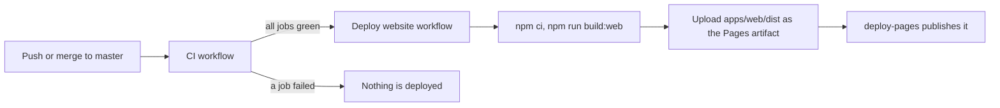

# Deploying the website

The Regimen website is a static site: plain HTML, CSS and JavaScript built by Vite from `apps/web`. There is no server and no database, because all data lives in the browser or the extension. So any free static host works.

**Supported deployment: GitHub Pages.** It is free, it is already set up, and the browser extension is built to trust exactly this address. The Netlify and Vercel files in [deploy/](deploy/) are optional examples for forks and for a later move.

## Current setup: GitHub Pages

| | |
|---|---|
| Address | https://aryanmotiani.github.io/regimen/ |
| Workflow | [.github/workflows/pages.yml](../.github/workflows/pages.yml) ("Deploy website") |
| Cost | free |
| Repository setting | Settings, Pages, Source: **GitHub Actions** |

How a change goes live:



- `pages.yml` runs on `workflow_run` of **CI**, only when CI succeeded on `master` (or `main`), and checks out the exact commit CI tested. A broken build never goes live.
- You can also run it by hand: Actions, **Deploy website**, Run workflow.
- Only one deploy runs at a time (`concurrency: pages`).

### Why it works on a sub-path

- `apps/web/vite.config.js` sets `base: './'`, so every asset URL is relative. The same build works at `/regimen/`, at the root of a custom domain, and inside the extension (`chrome-extension://<id>/app/`).
- The router uses hash URLs (`#/today`, `#/install?pair=...`), so the host only ever serves `index.html`. No rewrite or "single page app fallback" rules are needed on any host.

### The website address is part of the extension

The extension trusts one website without asking: the `homepage` in the root `package.json` (`https://AryanMotiani.github.io/regimen/`). `extension/build.mjs` bakes it into the manifest (the bridge content script only runs there) and into `isOfficialApp()`. The lock agent also embeds it for its pairing link (`scripts/build-agent.mjs`). Any other address still works as a standalone website, but the extension does not connect to it: only the official address and `localhost` (after **Allow** in the extension popup) get the bridge.

So if the website moves, change `homepage`, then release a new extension and lock agent. See [Custom domain](#custom-domain) below.

## Free alternatives, compared

All four serve the same build output (`apps/web/dist`) from the same command (`npm run build:web`).

| Host | Free tier | Set up | Good to know |
|---|---|---|---|
| **GitHub Pages** (current) | Free for public repositories, about 100 GB a month of bandwidth (soft limit) | Already done: `pages.yml` | Deploys only after CI is green. Shares the `aryanmotiani.github.io` origin with your other Pages sites until you add a custom domain |
| **Cloudflare Pages** | Free, unlimited bandwidth and requests, 500 builds a month | Connect the repository. Build command `npm run build:web`, output directory `apps/web/dist`. It reads the Node.js version from `.nvmrc` | Fast worldwide CDN, preview URL for every pull request, free custom domains with automatic HTTPS |
| **Netlify** | Free starter plan with a monthly bandwidth and build minutes allowance | Copy [deploy/netlify.toml](deploy/netlify.toml) to the repository root, then import the repository | Deploy previews for pull requests. Reads `.nvmrc` |
| **Vercel** | Free hobby plan for non-commercial use, with a monthly bandwidth allowance | Copy [deploy/vercel.json](deploy/vercel.json) to the repository root, then import the repository | Preview URLs for pull requests. The hobby plan does not allow commercial use |

Free tiers change over time, so check the current limits on each host's pricing page before you move. For this project any of them is far more than enough: the site is a few megabytes and every visitor loads it once, after which it runs locally.

**Recommendation for later:** stay on GitHub Pages and add a custom domain. If you ever want pull request previews or a CDN in front, Cloudflare Pages is the most generous free option. Whatever host you pick, keep exactly one official address, because the extension trusts one.

### Checking an alternative before switching

```bash
npm ci
npm run build:web
npm run preview -w apps/web   # serves apps/web/dist on http://localhost:4173
```

Open the printed address and click through `#/home`, `#/install` and `#/room`. If that works locally, it works on any static host, because nothing depends on server rules.

## Custom domain

A domain of your own (for example `regimen.app` or `regimen.example.org`) costs a few dollars a year at any registrar. The hosting stays free.

1. **Buy the domain** at any registrar.
2. **DNS**:
   - For a subdomain like `app.example.org`: add a `CNAME` record pointing to `aryanmotiani.github.io`.
   - For the bare domain `example.org`: add `A` records for GitHub Pages' four addresses (`185.199.108.153`, `185.199.109.153`, `185.199.110.153`, `185.199.111.153`) and, for IPv6, the matching `AAAA` records (`2606:50c0:8000::153` to `2606:50c0:8003::153`). Check [GitHub's custom domain docs](https://docs.github.com/pages/configuring-a-custom-domain-for-your-github-pages-site) for the current list.
3. **Verify the domain** for your account (Settings of your GitHub profile, Pages, Add a domain) so nobody else can claim it.
4. **Repository**: Settings, Pages, Custom domain: enter the domain, wait for the DNS check, then tick **Enforce HTTPS**. With the GitHub Actions source no `CNAME` file is needed in the build.
5. **Point Regimen at the new address**:
   - `homepage` in the root `package.json`, with a trailing slash: `https://example.org/`
   - the URLs in `apps/web/src/config.js` that point at the website (the GitHub links stay)
   - the privacy policy link in the store listings ([store/LISTING.md](store/LISTING.md)) and the links in the README and docs (`npm run set-repo` only rewrites GitHub links)
6. **Release** a new version (see [RELEASING.md](RELEASING.md)). The new extension trusts the new address and the new lock agent pairs through it.
7. **Keep the old address working** for a while: replace the old Pages site with a redirect page like [deploy/legacy-redirect/index.html](deploy/legacy-redirect/index.html) (pointing at the new domain), so extensions and lock agents that are not updated yet still reach the app.

Moving to a new address moves to a new browser origin. Data that someone kept on the website **without** the extension lives in that origin's `localStorage` and does not follow on its own: tell those users to use **Settings, Backup, Export** before the switch and **Import** after it. Extension users keep everything, because their data lives in the extension.

### Security: a custom domain fixes the shared origin

[SECURITY.md](../SECURITY.md) lists one known limit: `aryanmotiani.github.io` is a single browser origin for every GitHub Pages site of that account. Pages on one origin can script each other, so anything published under the account is trusted as much as the app itself. On its own domain the app has its own origin, so other repositories' Pages sites can no longer reach the website's storage or the extension bridge. Update SECURITY.md once the move is done.

## Old FocusGateway address

The project was called FocusGateway and lived at `https://aryanmotiani.github.io/focusgateway/` up to v1.2.0. GitHub redirects the old repository URL to the new one, but it does **not** redirect a renamed repository's Pages site, so the old address now shows a 404. Two things still point there: bookmarks, and the pairing link of lock agents that have not been updated yet (`regimen-agent pair` of a new agent uses the new address).

To keep them working, create a small public repository named `focusgateway` with [deploy/legacy-redirect/index.html](deploy/legacy-redirect/index.html) as its `index.html`, and turn on Pages for it (Deploy from a branch, `master`, `/`). It forwards `https://aryanmotiani.github.io/focusgateway/#/install?pair=...` to the same page on `/regimen/`. Both addresses share the `aryanmotiani.github.io` origin, so website data saved in the browser under the old address is still there, and the app moves its old `focusgateway:*` keys to the new `regimen:*` names on first load.
